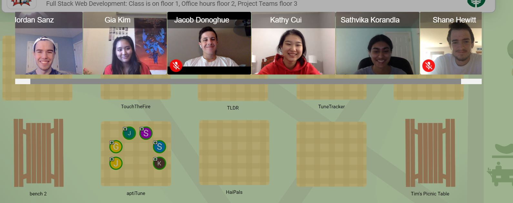

# aptiTune

Here's the API for *Aptitune*, an interactive sheet-music educational experience.

## Description

AptiTune is an interactive, sheet-music learning experience. Ever felt like sheet music was too difficult? That you had to be born the perfect Beethoven to do anything with music? AptiTune can fix that.

AptiTune introduces exciting, live, and dynamic lessons that utilize multiple game modes while still teaching you content. There's badges to win, stats to see, and quizzes to test your knowledge. Learn all about sheet music in a fun and new way.

AptiTune features many different types of lessons. The first is a simple, fill-in-the-blank exercise. It shows a snippet of sheet music, and asks the user to identify the notes on the staff. The second is a listening exercise that plays a piece of music, and asks the user to identify which snippet of sheet music is being played. The third is a rhythm-testing activity that has the user follow a beat by pressing the spacebar at the right rhythm. The final activity type is a pitch-matching activity, in which the user matches the pitches of a given piece of sheet music.

Currently, AptiTune has 4 lessons. Pitch I and II both teach about the notes on the treble clef; Rhythm 1 teaches basic quarter and half notes; and Quiz 1 tests on rhythm and pitch.

AptiTune keeps track of stats for you, so you can know when you're making real progress. We keep track of how you do on your quizzes, how many questions you've gotten right, how often you're using the web-app, and where your strong-suits are. AptiTune also awards badges when the user is doing well, keeping track of these badges in a badge library on the profile page. The profile page also features a selection of five icons and changing the user's display name.

## Architecture

*AptiTune* features a database built using *MongoDb*, holding lessons with multiple media types and user information. *AptiTune* links this database to the front-end using axios REST API, allowing the front-end to update and access the database. *AptiTune* is built upon a server using *express*. Additionally, *AptiTune* uses *mongoose* to design both user and lesson schemas for easy input into the *MongoDb* database. 

*AptiTune* also features a built-in, local authentication, created using *passport*. It also stores multiple media types, such as images and audio files, in *AWS S3* for easy access. 

## Setup

To setup, simply run `yarn install`.

## Deployment

This backend API is deployed on heroku at the following:
[backend](https://aptitune-api.herokuapp.com/)

## Authors

Shane Hewitt 
Jacob Donoghue 
Sathvi Korlanda 
Gia Kim 
Kathy Cui 
Jordan Sanz 

## Acknowledgments

We'd like to thank Tim Tregubov for teaching us how to make a web app in 10 weeks. We'd also like to thank every react package author who writes a lot of documentation. You are the best.
